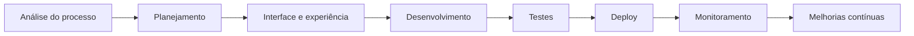

<div align="center">


<br>


<br>

### Soluções empresariais modernas, seguras e escaláveis

Desenvolvemos aplicações web, PWAs, automações, sistemas de gestão e infraestrutura própria de backup.

<br>


</div>

---

## Sobre a Conquista Gestão

A **Conquista Gestão** desenvolve soluções digitais para empresas que precisam modernizar processos, organizar operações e integrar dados com segurança.

Nossos projetos são construídos com foco em:

```text
✓ Desempenho
✓ Segurança
✓ Escalabilidade
✓ Automação
✓ Experiência offline
✓ Sincronização em nuvem
✓ Backup independente
✓ Interfaces responsivas
✓ Código organizado
✓ Manutenção simplificada
```

---

## Tecnologias

<div align="center">


<br><br>


</div>

---

## Soluções desenvolvidas

<table>
<tr>
<td width="50%" valign="top">

### 🚛 Checklist de Caminhões e Máquinas

Sistema PWA para inspeções operacionais de veículos e equipamentos.

**Principais recursos:**

- funcionamento offline;
- histórico por motorista;
- identificação por veículo;
- fotos e gravações de áudio;
- sincronização com Firebase;
- backup automático em servidor próprio;
- organização por data, motorista e placa;
- relatórios e acompanhamento de não conformidades.

</td>

<td width="50%" valign="top">

### 🏢 Conquista Imobiliária

Plataforma para gestão imobiliária e organização de processos internos.

**Principais recursos:**

- gestão de imóveis;
- controle de usuários;
- dashboards operacionais;
- relatórios;
- automações;
- integração em nuvem;
- interface responsiva;
- organização de documentos e registros.

</td>
</tr>

<tr>
<td width="50%" valign="top">

### 📦 Servidor Local de Backup

Infraestrutura própria para recebimento e organização automática de arquivos.

**Principais recursos:**

- API autenticada;
- múltiplos aplicativos;
- perfis independentes;
- Cloudflare Tunnel;
- domínio próprio;
- backup de JSON, imagens e áudios;
- execução automática no Windows;
- painel de status e gerenciamento.

</td>

<td width="50%" valign="top">

### 📊 Sistemas Empresariais

Aplicações desenvolvidas para necessidades específicas de operação e gestão.

**Exemplos:**

- dashboards;
- controle operacional;
- gestão de equipes;
- relatórios personalizados;
- automação de processos;
- sincronização em nuvem;
- ferramentas administrativas;
- integrações entre sistemas.

</td>
</tr>
</table>

---

## Áreas de atuação

<div align="center">


</div>

---

## Arquitetura das soluções

```text
Aplicativo Web / PWA
        │
        ├── Autenticação
        ├── Banco de dados em nuvem
        ├── Armazenamento de arquivos
        ├── Funcionamento offline
        ├── Sincronização automática
        └── Servidor próprio de backup
                │
                ├── JSON
                ├── Imagens
                ├── Áudios
                ├── Metadados
                ├── Logs
                └── Organização automática
```

---

## Infraestrutura

<div align="center">

<table>
<tr>
<td align="center" width="25%">

### ☁️ Cloud

Firebase  
Cloudflare  
Vercel

</td>
<td align="center" width="25%">

### 🖥️ Backend

Node.js  
REST APIs  
Servidores locais

</td>
<td align="center" width="25%">

### 📱 Frontend

React  
TypeScript  
PWA

</td>
<td align="center" width="25%">

### 🔐 Segurança

Autenticação  
Chaves privadas  
Controle de acesso

</td>
</tr>
</table>

</div>

---

## Estatísticas do GitHub

<div align="center">


</div>

> Como a maioria dos projetos é privada, algumas estatísticas podem exibir apenas a atividade pública.

---

## Atividade de desenvolvimento

<div align="center">


</div>

---

## Foco de desenvolvimento

<table>
<tr>
<td width="50%">

### Desenvolvimento

- aplicações empresariais;
- plataformas responsivas;
- PWAs offline-first;
- dashboards operacionais;
- APIs e integrações;
- sistemas internos;
- ferramentas administrativas.

</td>

<td width="50%">

### Infraestrutura

- sincronização em nuvem;
- backup automático;
- servidores locais;
- autenticação;
- controle de acesso;
- organização de arquivos;
- disponibilidade de serviços.

</td>
</tr>
</table>

---

## Fluxo de desenvolvimento



---

## Princípios

<div align="center">

| Princípio | Objetivo |
|---|---|
| Arquitetura organizada | Facilitar manutenção e crescimento |
| Segurança | Proteger usuários, acessos e dados |
| Offline-first | Manter o sistema funcional sem internet |
| Backup independente | Reduzir riscos de perda de informações |
| Automação | Eliminar tarefas repetitivas |
| Escalabilidade | Preparar o sistema para crescimento |
| Experiência do usuário | Criar interfaces simples e eficientes |

</div>

---

## Projetos privados

A maior parte dos projetos da **Conquista Gestão** está armazenada em repositórios privados.

Esses repositórios incluem:

```text
• aplicações empresariais;
• plataformas internas;
• sistemas de gestão;
• infraestrutura de backup;
• integrações;
• automações;
• APIs;
• ferramentas administrativas;
• projetos em desenvolvimento.
```

---

## Status

<div align="center">


</div>

---

<div align="center">


## Conquista Gestão

### Tecnologia aplicada à gestão empresarial

**Software • Cloud • Automação • Infraestrutura**

<br>


</div>

<div align="center">

### Conquista Gestão

**Tecnologia aplicada à operação empresarial.**


</div>
